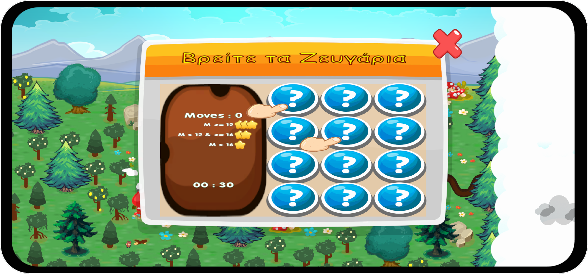
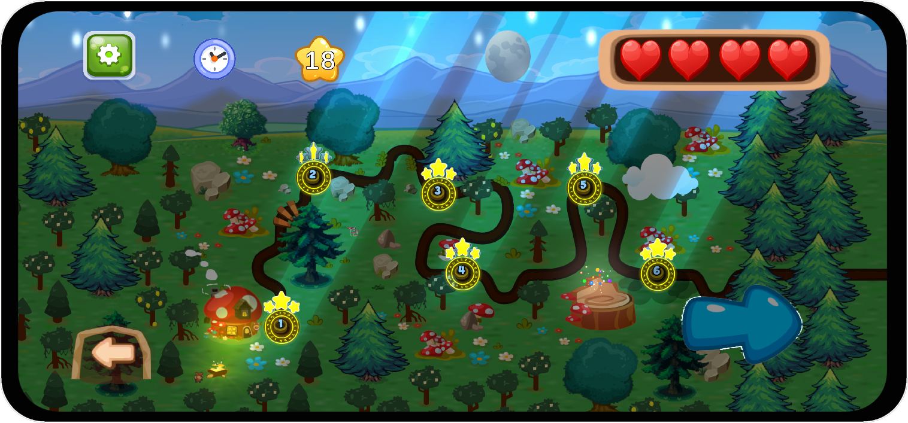
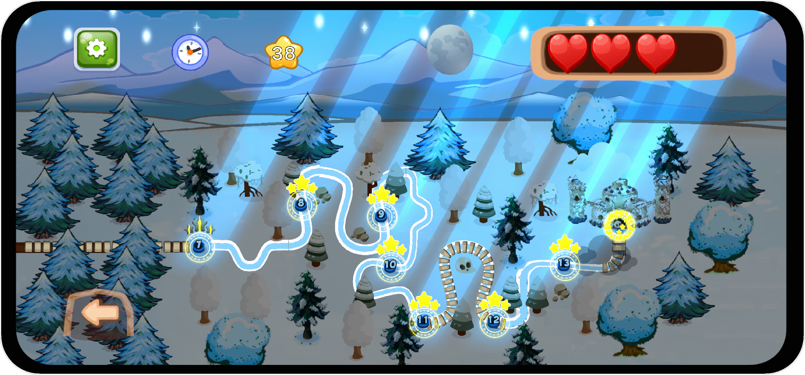

# This app is an Educational Game made with Unity game Engine and was made for my University Thesis

“Design and development of an interactive educational game for kids, based on Unity 3D game engine,
for desktop PCs and smart mobile platforms”

**Windows** | **Android** | **WebGL**
:--------:  | :--------:  | :--------:
  ~44Mb     |   ~43Mb     |  [Play](https://romposthesis.netlify.app/)

